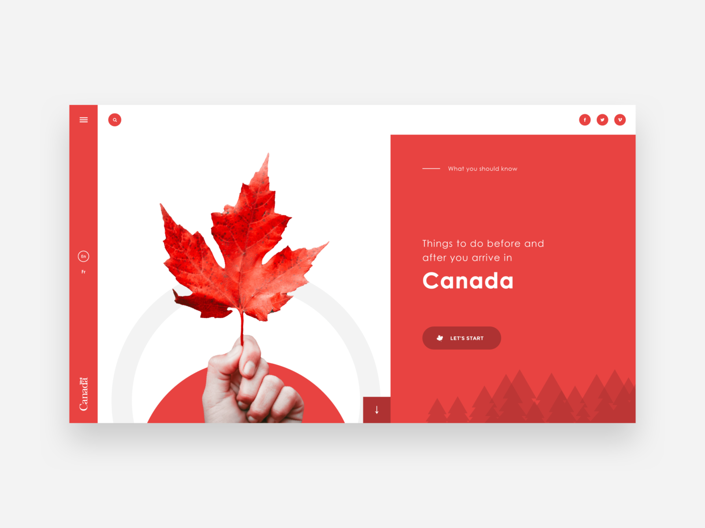

# Canada

## Demo

## Screenshots

### 1) Desktop

### 2) Mobile

## 1. Concept

The website that includes photos that are taken in Canada this thanksgiving holiday. Based on the red and white main color of Canada, I focused on dynamic and interactive funcitonalities of the website, such as animations and hover effects.

## 2. Moodboard

### 1) Canada Theme Website

    

### 2) Campbell's Soup Cans, Andy Warhol

    

### 3) iphone Albums Map

    

## 3. Design

<a href="https://www.figma.com/file/b9tdhg9q64ka04KFMAMQ7J/DM-UY-2193-Intro-to-Web-Development?type=design&node-id=219%3A909&mode=design&t=XftJpGnoAVlL9X35-1">🎨 Figma: Design</a>

## 4. Prototype

<a href="https://www.figma.com/proto/b9tdhg9q64ka04KFMAMQ7J/DM-UY-2193-Intro-to-Web-Development?page-id=219%3A909&type=design&node-id=219-910&viewport=126%2C153%2C0.14&t=0MKblED8QKrBawNw-1&scaling=min-zoom&starting-point-node-id=219%3A910&mode=design">🛠️ Figma: Desktop Prototype</a>

## 5. Develop

### 1) Hover Effect

I implemented the hover effect using css hover selector. I applied various kind and duration of transition to each components in index.html. When user hovers to specific block, the flex size of block increases, image in the block expands, and the size of texts in the block grows with ease in ease out transition. Each transition time is set differently so that user can feel the natural feeling of dynamic, interactive animation.

⌨️ Code Snippet

    .thumbnail {
        display: flex;
        align-items: center;
        flex: 1;
        overflow: hidden;
        transition: all 1s ease;
    }

    .thumbnail:hover {
        flex: 7;
    }

    .thumbnail img {
        width: 100%;
        height: auto;
        transition: all 2s ease;
    }

    .thumbnail:hover img {
        transform: scale(1.25);
    }

    .thumbnail .indexLargeText {
        font-family: Impact, Haettenschweiler, 'Arial Narrow Bold', sans-serif;
        font-weight: bold;
        font-size: 64px;
        transition: all 1s ease;
    }

    .thumbnail:hover .indexLargeText {
        font-size: 96px;
    }

    .thumbnail .indexSizedBox {
        width: 0px;
        height: 0px;
        transition: all 0.33s ease;
    }

    .thumbnail:hover .indexSizedBox {
        width: 16px;
        height: 16px;
    }

    .thumbnail .indexSmallText {
        font-family: Impact, Haettenschweiler, 'Arial Narrow Bold', sans-serif;
        font-weight: bold;
        font-size: 0px;
        transition: all 0.33s ease;
    }

    .thumbnail:hover .indexSmallText {
        font-size: 32px;
    }

### 2) Animation

When user clicks specific block in the main page, the animation of numerous name of given region slides in appears. The names fully fills the screen and soon, the names slides out and the map of the given region appears. This animation is inspired of the work "Campbell's Soup Cans, Andy Warhol", which I recently saw in Museum of Modern Arts located in New York. Also, it is intended to give feeling of traveling to the city to user with the smooth transition of pages. Numerous names are the abstraction of the tickets heading to given location, like flight ticket or train ticket.

⌨️ Code Snippet

    const niagaraFallsSizedBoxSize = 720;

    function niagaraFallsAnimateIn() {
        document.getElementById("niagaraFallsStack").style.visibility = "visible";

        const start = Date.now();
        const duration = 2000; // Duration of the animation in milliseconds
        const sizedBoxes = document.getElementsByClassName("niagaraFallsSizedBox");

        function easeInOutCubic(t) {
            return t < 0.5 ? 4 * t * t * t : 1 - Math.pow(-2 * t + 2, 3) / 2;
        }

        function animate() {
            const elapsed = Date.now() - start;
            let fraction = elapsed / duration;
            fraction = easeInOutCubic(fraction); // Apply easing function

            Array.prototype.forEach.call(sizedBoxes, function(sizedBox) {
                sizedBox.style.height = (niagaraFallsSizedBoxSize - (niagaraFallsSizedBoxSize * fraction)).toString() + "vh";
            });

            if (elapsed < duration) {
                requestAnimationFrame(animate); // Continue the animation
            } else {
                Array.prototype.forEach.call(sizedBoxes, function(sizedBox) {
                    sizedBox.style.height = "0vh"; // Set final height
                });

                window.location.href = "niagaraFalls.html";
            }
        }

        requestAnimationFrame(animate); // Start the animation
    }

    function niagaraFallsAnimateOut() {
        const start = Date.now();
        const duration = 2000; // Duration of the animation in milliseconds
        const sizedBoxes = document.getElementsByClassName("niagaraFallsSizedBox");

        function easeInOutCubic(t) {
            return t < 0.5 ? 4 * t * t * t : 1 - Math.pow(-2 * t + 2, 3) / 2;
        }

        function animate() {
            const elapsed = Date.now() - start;
            let fraction = elapsed / duration;
            fraction = easeInOutCubic(fraction); // Apply easing function

            Array.prototype.forEach.call(sizedBoxes, function(sizedBox) {
                sizedBox.style.height = (niagaraFallsSizedBoxSize * fraction).toString() + "vh";
            });

            if (elapsed < duration) {
                requestAnimationFrame(animate); // Continue the animation
            } else {
                Array.prototype.forEach.call(sizedBoxes, function(sizedBox) {
                    sizedBox.style.height = niagaraFallsSizedBoxSize.toString() + "vh"; // Set final height
                });

                document.getElementById("niagaraFallsStack").style.visibility = "collapse";
            }
        }

        requestAnimationFrame(animate); // Start the animation
    }

### 3) Google Map and Pin

Using Google Map API, I implemented the system that includes map of the city that I visited and the pins that indicates the place I visited in the city. The center of the map and location of the pin is decided based on the latitude and longitude data of given picture.

⌨️ Code Snippet

    const niagaraFallsModals = document.getElementsByClassName("modal");
    const overlay = document.querySelector(".overlay");
    const niagaraFallsCloseButtons = document.getElementsByClassName("btn-close")

    function openModal(i) {
        niagaraFallsModals[i].classList.remove("hidden");
        overlay.classList.remove("hidden");
    };

    function closeModal(i) {
        niagaraFallsModals[i].classList.add("hidden");
        overlay.classList.add("hidden");
    };

    Array.prototype.forEach.call(niagaraFallsCloseButtons, function(niagaraFallsCloseButton, i) {
        niagaraFallsCloseButton.addEventListener("click", () => {
            closeModal(i);
        })
    });

    async function initMap() {
        const posNiagaraFalls = {lat: 43.08331405964661, lng: -79.07403101822439};

        const { Map } = await google.maps.importLibrary("maps");
        const { AdvancedMarkerView } = await google.maps.importLibrary("marker");
        const { PinView } = await google.maps.importLibrary("marker");
        const infoWindow = new google.maps.InfoWindow();

        let map = new Map(document.getElementById("map"), {
            zoom: 16,
            center: posNiagaraFalls,
            mapId: "DEMO_MAP_ID",
        });

        const tourStops = [
            {
                position: {lat: 43.08684355911157, lng: -79.0665401778558},
                title: "Niagara Falls State Park Administration",
            },
            {
                position: {lat: 43.08157152748957, lng: -79.07100348838995},
                title: "Niagara Falls Adventures",
            },
            {
                position: {lat: 43.09037318206784, lng: -79.06755613706792},
                title: "Rainbow Bridge",
            },
            {
                position: {lat: 43.08930760969704, lng: -79.07311367392514},
                title: "Welcome Center",
            },
            {
                position: {lat: 43.079262403029816, lng: -79.07887319293789},
                title: "Table Rock Welcome Centres",
            },
        ];

        tourStops.forEach(({ position, title }, i) => {
            const pinView = new PinView({
                glyph: `${i + 1}`,
            });

            const marker = new AdvancedMarkerView({
                position,
                map,
                title: `${i + 1}. ${title}`,
                content: pinView.element,
            });

            marker.addEventListener("gmp-click", () => {
                openModal(i);
            });
        });
    }

    initMap();

### 4) Modal

If the user clicks the pin in specific map, the grayscale overlay turns on and single modal that has an image of given location as its child pops up. I manipulated the size of the modal based on the type of image, either vertical or horizontal, and the user can close the modal by left top close button.

⌨️ Code Snippet

    .modal {
        display: flex;
        flex-direction: column;
        justify-content: center;
        gap: 16px;
        padding: 16px;
        position: absolute;
        top: 50%;
        left: 50%;
        transform: translate(-50%, -50%);
        background-color: white;
        border: 1px solid #ddd;
        border-radius: 15px;
        z-index: 2;
    }

    .vertical {
        width: 33%;
    }

    .horizontal {
        width: 50%;
    }

    .modal .flex {
        display: flex;
        align-items: center;
        justify-content: space-between;
    }

    button {
        cursor: pointer;
        border: none;
        font-weight: 600;
    }

    .btn-close {
        padding: 16px 18px;
        background: #eee;
        border-radius: 50%;
    }

    .overlay {
        position: fixed;
        top: 0;
        bottom: 0;
        left: 0;
        right: 0;
        width: 100%;
        height: 100%;
        background: rgba(0, 0, 0, 0.5);
        backdrop-filter: blur(3px);
        z-index: 1;
    }

    .hidden {
        display: none;
    }

### 5) Media Query

I also manipulated some size, width, and height of the components in the website in order to implement media query system. I refered to iPhone 14 Pro while developing for media query.

⌨️ Code Snippet

    @media only screen and (max-width: 1633px) {
        .thumbnail .indexLargeText {
            font-size: 32px;
        }

        .thumbnail:hover .indexLargeText {
            font-size: 48px;
        }

        .thumbnail .indexSizedBox {
            width: 0px;
            height: 0px;
        }

        .thumbnail:hover .indexSizedBox {
            width: 8px;
            height: 8px;
        }

        .thumbnail .indexSmallText {
            font-size: 0px;
        }

        .thumbnail:hover .indexSmallText {
            font-size: 16px;
        }

        .niagaraFallsTextStyle {
            font-size: 40px;
        }

        .torontoTextStyle {
            font-size: 40px;
        }

        .quebecCityTextStyle {
            font-size: 40px;
        }

        .montrealTextStyle {
            font-size: 40px;
        }
    }

## 6. Improvement

### 1) Auto Pin Generation

for file in folder
add html element of file in document
add pin on map based on file.location and file.image

### 2) Cluster Image

construct a graph data structure that includes all pin in the map.
construct as large as possible subgraph that edges in the subgraph is (distance / zoom) and containing as many as possible nodes.
combine all pin in each subgraphs to one pin and display in the map.
if zoom rate differs, recalculate the subgraphs and redisplay them.

### 3) Modulize

Modulize "niagaraFallsAnimation.js", "torontoAnimation.js", "quebecCityAnimation.js", and "montrealAnimation.js" to "animation.js" with sufficient parameter.
Modulize "niagaraFallsMap.js", "torontoMap.js", "quebecCityMap.js", and "montrealMap.js" to "map.js" with sufficient parameter.
Moulize "niagaraFalls.html", "toronto.html", "queubecCity.html", and "montreal.html" with sufficient parameter if possible.x``
