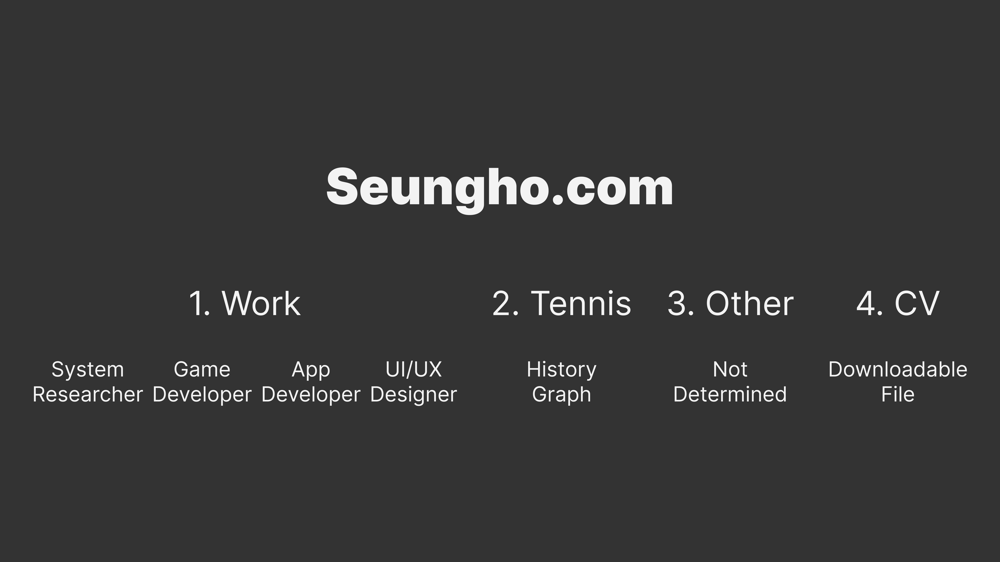

# Week04

## 1. concept|theme of site (not just random images and links that show skill)

The website about me, seungho.com.

## 2. site map and wireframes

<a href="https://www.figma.com/proto/b9tdhg9q64ka04KFMAMQ7J/DM-UY-2193-Intro-to-Web-Development?page-id=0%3A1&type=design&node-id=13-31&viewport=158%2C-651%2C0.18&t=G81eDzx9lISq16DH-1&scaling=scale-down&starting-point-node-id=13%3A31&show-proto-sidebar=1&mode=design">Work Wireframe Prototype</a>

<a href="https://www.figma.com/proto/b9tdhg9q64ka04KFMAMQ7J/DM-UY-2193-Intro-to-Web-Development?page-id=0%3A1&type=design&node-id=15-148&viewport=158%2C-651%2C0.18&t=G81eDzx9lISq16DH-1&scaling=scale-down&starting-point-node-id=15%3A148&show-proto-sidebar=1&mode=design">Tennis Wireframe Prototype</a>

## 3. an existing website you drew inspiration from (bonus points for pinterest collection or mood board)

## 4. concepts|skills we have covered that you will use to build your site

### 4-1. HTML

- Elements
- Attributes
- Headings
- Paragraphs
- Styles
- Formatting
- Colors
- Links
- Images
- Page Title
- Lists
- Block & Inline
- Classes
- Id
- File Paths
- Head
- Layout
- Responsive

### 4-2. CSS

- Selectors
- Colors
- Backgrounds
- Borders
- Margins
- Padding
- Height/Width
- Text
- Fonts
- Icons
- Links
- Lists
- Display
- Max-width
- Position
- Z-index
- Overflow
- Float
- Inline-block
- Align
- Navigation Bar
- Image Gallery
- Image Sprites
- Attr Selectors
- Website Layout
- Units

## 5. concepts|skills you need to still learn to complete the project

### 4-1. HTML

- Review
- Favicon
- Media
- Video

### 4-2. CSS

- Review
- Dropdowns
- Responsive
