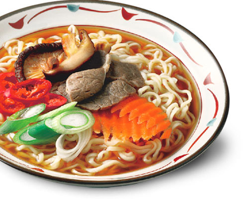
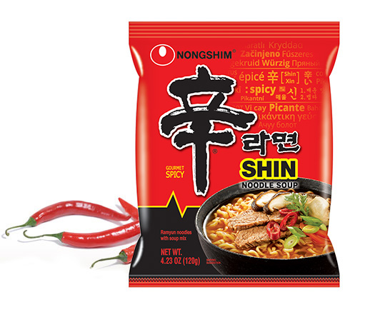
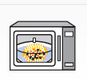

# Shin Ramen

|  |  |
| ---------------------- | ---------------------- |

The soft and chewy noodle combined with the spicy beef broth creates the perfect recipe that will please any palate. As soon as it was released on the market, Shin Ramyun became an instant hit among consumers who especially liked bold flavors. You might be surprised by the level of spiciness at first, but the delicious mélange of flavors will soon have you crave for more. The excellent spicy flavor, cooked with beef, mushrooms, and carrots, was inspired by the world’s finest peppers, and has become a typical flavor of Korea that soon became globally known.

## 1. Ingredients

- Shin Ramen
- Water

## 2. Instructions

### 2-1. Stove Top

| 1. Boiling Water                                                                    | 2. Cooking noodles                           | 3. Enjoy                    |
| ----------------------------------------------------------------------------------- | -------------------------------------------- | --------------------------- |
|                                                              |                       |      |
| Boil 550 mL (about 2 1/3 cups) of water. Add noodles, soup base, and vegetable mix. | Cook for 4-5 minutes, stirring occasionally. | Remove from heat and serve. |

### 2-2. Microwave (1000W)

| 1. Put ingredients                                                                  | 2.Pour water                                          | 3. Cooking Noodles                                                                                     |
| ----------------------------------------------------------------------------------- | ----------------------------------------------------- | ------------------------------------------------------------------------------------------------------ |
|                                                              |                                |                                                                                 |
| Put soup base and vegetable mix into a microwaveable bowl, then add noodles on top. | Pour 470 mL (about 2 cups) of room temperature water. | Place a microwaveable cover on the bowl. Cook for 7 minutes. When using hot water, cook for 4 minutes. |

## 3. Reference

[Nongshim Shin Ramen](https://nongshimusa.com/homev2/our-products/shin-brand/shin-ramyun/)
